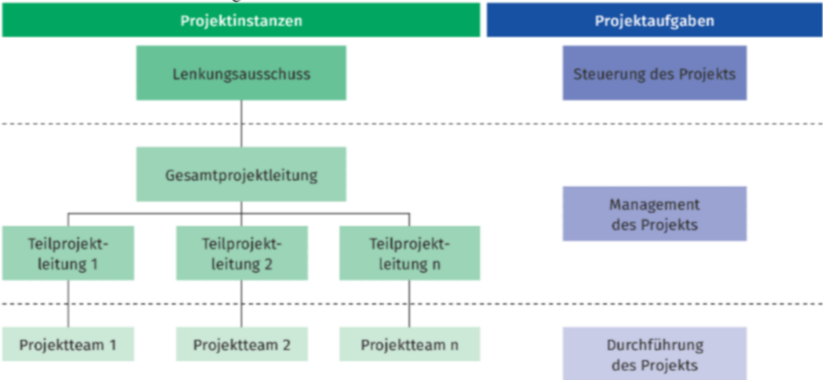

# Klausurvorbereitung Lernfeld 5 bei König

## Aufgaben und Kompetenzen eines Entwicklers.

- Aufgaben:
  - Softwareentwicklung: Hier entwickelst du Anwendungen oder Systeme.
  - Fehlerbehebung: Identifizieren und beheben von Problemen in bestehendem Code.
  - Testing: Gewährleisten, dass die Software reibungslos läuft.
  - Dokumentation: Wichtige Infos zu Code und Prozessen festhalten
- Kompetenzen:
  - Programmiersprachen: Je nach Aufgabe sind Kenntnisse in verschiedenen Sprachen wichtig.
  - Problemlösung: Kreatives Denken, um Herausforderungen zu bewältigen.
  - Teamarbeit: Zusammenarbeit mit anderen Entwicklern und Fachleuten.
  - Lernbereitschaft: Da sich die Technologie ständig weiterentwickelt ist kontinuierliches Lernen wichtig.

---

## Softwaredefinition und Softwarearten

### Softwaredefinition nach IEEE Standard 610.12:

- Arbeitsblatt:
  - Software umfasst alle Programme, vorgeschriebenen Abläufe, Dokumentation und Daten, die zum Betrieb eines Rechnersystem erforderlich sind.
- [Wikipedia:](https://de.wikipedia.org/wiki/Software#Definitionen_nach_ISO/IEC-Norm_24765)
  - Software ist ein Programm oder eine Menge von Programmen, die dazu dienen, einen Computer zu betreiben.
  - Software sind Programme sowie die zugehörige Dokumentation.
  - Software sind Programme und ggf. die zugehörige Dokumentation und weitere Daten, die zum Betrieb eines Computers notwendig sind.

### Die drei Arten der Software

- Systemsoftware:
  - Systemsoftware ist grundlegende Software, die die Hardware steuert und dem Benutzer die Interaktion mit dem Computer ermöglicht.
  - Unterstützt und ermöglicht das Ausführen von Anwendungssoftware
  - **Beispiele:** Betriebssysteme, Treiber usw.
- Unterstützungssoftware:
  - Eine Art Software, die Anwendungen verbindet und die Kommunikation zwischen verschiedenen Softwarekomponenten ermöglicht.
  - Programme, welche bei der Entwicklung helfen oder nicht anwendungsspezifische Leistungen erbringen.
  - **Beispiele:** Compiler, Editoren, Webserver usw.
- Anwendungssoftware:
  - Anwendersoftware ist speziell für die Benutzererfahrung entwickelte Software, um bestimmte Aufgaben zu erfüllen.
  - Umfasst alle Programme, die betriebswirtschaftliche , wissenschaftliche, technische oder branchenbezogene Anwendungen unterstützen.
  - **Beispiele:** Textverarbeitungssoftware (z.B. Microsoft Word), Grafikdesign-Tools (z.B. Adobe Photoshop, Lern- und Unterhaltungssoftware, Buchhaltungssoftware usw.).

## Einteilung von Software nach dem Grad der Individualisierung.

- Standardsoftware:
  - **Definition:** Standardsoftware ist vorgefertigte Software, die für eine breite Benutzergruppe entwickelt wurde.
  - **Eigenschaften:** Allgemein für viele Benutzer, nicht an individuelle Anforderungen angepasst. Wird mittels Customizing oder Erweiterungsprogrammierung an Unternehmensprozesse und Strukturen angepasst.
  - **Beispiele:** Microsoft Office, Adobe Acrobat.

- Individualsoftware:
  - **Definition:** Individualsoftware ist maßgeschneiderte Software, die speziell für die Bedürfnisse eines einzelnen Benutzers oder Unternehmens entwickelt wurde.
  - **Eigenschaften:** Auf spezifische Anforderungen zugeschnitten, einzigartig für den Benutzer oder das Unternehmen. Flexibel und anbindbar an weitere Software im Unternehmen.
  - **Beispiele:** Kundenspezifische Unternehmensanwendungen, maßgeschneiderte Datenbanklösungen.
  
---

## Arten der Softwareanpassung

### Customizing

- **Erklärung:** Customizing bedeutet das Anpassen von Standardsoftware an die individuellen Wünsche des Kunden. Dabei Wird der Quellcode nicht verändert.
**Es werden folgende Vorgehensweisen unterschieden:**
- **Konfiguration:** Hier Wird durch die Auswahl und Konfiguration von
entsprechenden Modulen die Software angepasst.
- **Parametrisierung:** Hier Wird durch das Setzen von Parametern die
Software auf den benötigten Funktionsumfang angepasst. Dabei werden
Teile der Standardsoftware aktiviert bzw. deaktiviert.
_Beispiel:_ In einem E-Commerce-System kannst du das Aussehen und die Farben der Benutzeroberfläche anpassen, ohne den zugrunde liegenden Code zu ändern. Dies geschieht häufig über Konfigurationsoptionen im Administrationsbereich.

### Erweiterungsprogrammierung

- **Erklärung:** Erweiterungsprogrammierung Wird zur Anpassung einer Standardsoftware genutzt, wenn die Möglichkeiten vom Customizing nicht ausreichen. Dabei Wird die Software um individuell entwickelte Programmteile erweitert,welche über definierte Schnittstellen mit dem Hauptprogramm verbunden werden.
- _Beispiel:_ Bei Google Chrome kannst du Erweiterungen wie "AdBlock" hinzufügen, um zusätzliche Funktionen zur Blockierung von Anzeigen zu integrieren.

### Neuentwicklung

**Erklärung:** Reichen die Möglichkeiten von Customizing und Erweiterungsprogrammierung nicht aus, Wird die Software komplett neu als Individualsoftware entwickelt.
_Beispiel:_ Angenommen, du nutzt eine veraltete Notiz-App, die grundlegende Funktionen bietet. Die Entwickler entscheiden sich jedoch, die App von Grund auf neu zu erstellen. Die Neuentwicklung würde bedeuten, dass sie die gesamte App von Anfang an neu schreiben, um sie moderner, schneller und mit erweiterten Funktionen zu gestalten. Denke an Evernote als Beispiel, das über die Jahre mehrere Neuentwicklungen durchlaufen hat, um seinen Funktionsumfang zu erweitern.

### Datenmigration

**Erklärung:** Bei der Datenmigration Wird ein vorhandenes System zur Verwaltung von Daten durch ein neues ersetzt. Dabei müssen die Daten vom Altsystem auf
das neue System übertragen werden.
_Beispiel:_  Bei der Einführung einer neuen Version von Facebook ändert das Unternehmen die Datenbankstruktur, um die Effizienz zu steigern. Die Datenmigration gewährleistet, dass alle bestehenden Benutzerprofile, Beiträge und Verbindungen ohne Datenverlust in das aktualisierte System übertragen werden.

---

## Projektbegriff

## Projektdefinition nach DIN 69901

Als Projekt wird ein Vorhaben bezeichnet, welches im Wesentlichen durch die Einmaligkeit der Bedingungen in ihrer Gesamtheit gekennzeichnet ist, z.B.

- Zielvorgaben
- zeitliche, finanzielle, personelle oder andere Begrenzungen,
- Abgrenzungen gegenüber anderen Vorhaben,
- projektspezifische Organisation.

## Interne Projektstruktur

- Lenkungsausschuss:
  - **Funktion:** Der Lenkungsausschuss ist eine übergeordnete Instanz ( Auftraggeber, Stakeholder ), die strategische Entscheidungen trifft und die Gesamtprojektleitung unterstützt indem sie Ihre Anforderung klar formuliert.
- Gesamtprojektleitung:
  - **Verantwortlichkeiten:** Die Gesamtprojektleitung hat die oberste Verantwortung für das gesamte Projekt. Sie stellt sicher, dass die Projektziele erreicht werden und koordiniert die verschiedenen Teilprojekte.
- Teilprojektleitung:
  - **Verantwortlichkeiten:** Jede Teilprojektleitung ist verantwortlich für einen spezifischen Bereich des Projekts und berichtet an die Gesamtprojektleitung.
- Projektteam:
  - **Zusammensetzung:** Jede Teilprojektleitung hat ihr eigenes Projektteam.
  - **Aufgaben:** Das Team ist verantwortlich für die Durchführung der Aufgaben, die von der Teilprojektleitung zugewiesen wurden.

# Projektphasen

![[../assets/img/projektphasen.png]]

- Projektstart:
  - **Ziel:** Klare Definition der Projektziele, Anforderungen und Hauptbeteiligten.
  - **Aktivitäten:** Initiierung des Projekts, Identifizierung der Stakeholder, Festlegung von Projektparametern und Erstellung eines Projektauftrags.
- Projektplanung:
  - **Ziel:** Erstellung eines umfassenden Plans, der den gesamten Projektablauf abdeckt.
  - **Aktivitäten:** Aufstellen von Zeitplänen, Ressourcenallokation, Risikomanagement, Definition von Meilensteinen und Entwicklung von Kommunikationsplänen.
- Projektdurchführung:
  - **Ziel:** Umsetzung des Projektplans und Entwicklung der eigentlichen Softwarelösung.
  - **Aktivitäten:** Programmierung, Design, Testing, Integration und kontinuierliche Kommunikation im Team.
- Projektkontrolle:
  - **Ziel:** Überwachung und Steuerung des Projektablaufs, um sicherzustellen, dass Ziele erreicht werden.
  - **Aktivitäten:** Regelmäßige Fortschrittsüberprüfungen, Anpassungen des Plans bei Bedarf, Risikomanagement und Qualitätssicherung.
- Projektabschluss:
  - **Ziel:** Formaler Abschluss des Projekts und Übergabe der Ergebnisse an die Stakeholder.
  - **Aktivitäten:** Erstellung von Abschlussberichten, Evaluation des Projekterfolgs, Feierlichkeiten für das Team und Übergabe der Software an den Kunden.

# Software Lebenszyklus (SDLC)
! [Pasted image 20231111235950.png]]
#### Anforderungsanalyse und Erstellung einer Spezifikation
- **Ziel:** Festlegung der Anforderungen an die Software.
- **Aktivitäten:** Erfassen von Kundenwünschen, Erstellung von Pflichten- und Lastenheften, Analyse von Geschäftsprozessen und Daten.
#### Design
- **Ziel:** Entwurf der Software unter Verwendung von Modellen.
- **Aktivitäten:** Erstellung von UML-Klassendiagrammen, Struktogrammen für Algorithmen, Abgrenzung relevanter Daten, Spezifikation des Datenbanksystems.
####  Umsetzung (Implementierung)
- **Ziel:** Programmierung der Software in der gewählten Programmiersprache.
- **Aktivitäten:** Implementierung der geplanten Funktionen, Übergang zur Testphase.
#### Testen
- **Ziel:** Überprüfung, ob die Software die definierten Anforderungen erfüllt.
- **Aktivitäten:** Durchführung von Modul-, Integrations-, System- und Akzeptanztests.
#### Auslieferung
- **Ziel:** Bereitstellung der Software für den Auftraggeber bzw. Anwender.
- **Aktivitäten:** Installation, Konfiguration und Übergabe an den Kunden.
#### Wartung und Support
- **Ziel:** Pflege der Software nach der Auslieferung.
- **Aktivitäten:** Fehlerbehebungen, Leistungsverbesserungen, Anpassungen an neue Anforderungen.